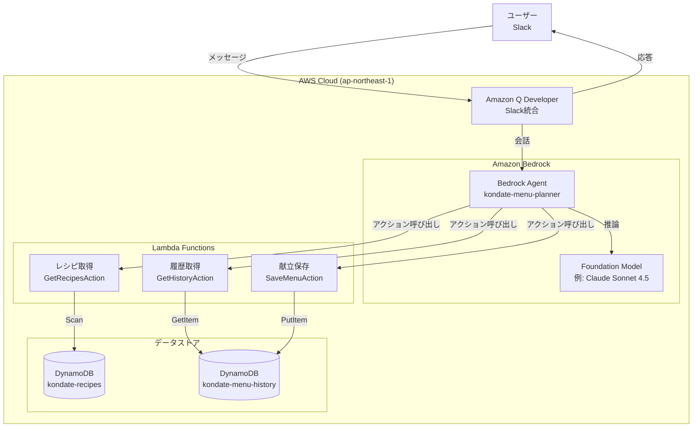
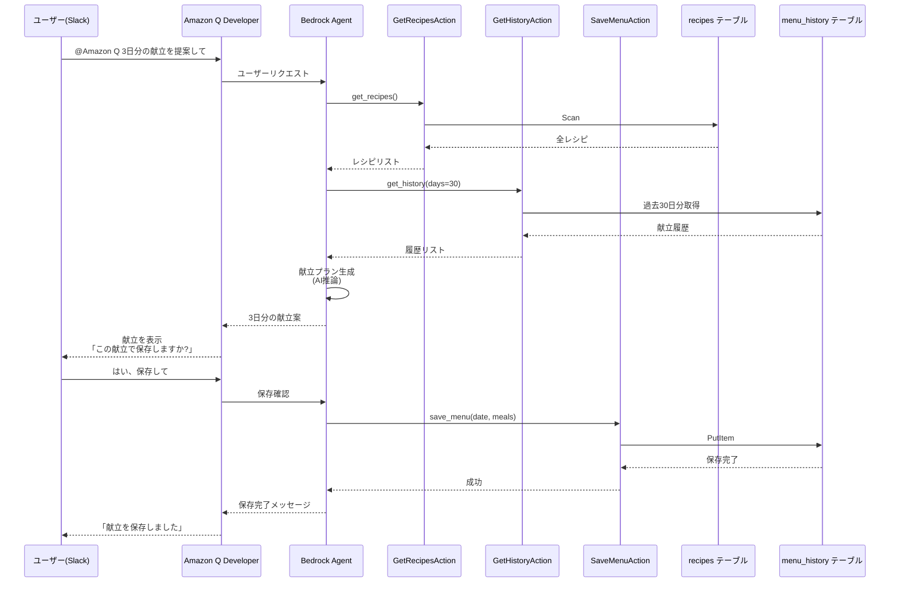

# Kondate Planner

AWS SAMを使った個人利用の献立提案アプリケーションです。Amazon Bedrock Agentを使って、Slack経由で自然な会話形式で献立を提案します。

## 機能概要

- **Slack経由の対話型献立提案**: Amazon Q Developerを通じてSlackから自然言語で献立をリクエスト
- **AI献立生成**: Bedrock Agentが過去の履歴を考慮してバランスの良い献立を提案
- **履歴管理**: 過去の献立を参照し、同じレシピの繰り返しを避ける
- **明示的な保存確認**: ユーザーが承認した献立のみを保存

## システムアーキテクチャ

### 全体構成



Amazon Q DeveloperがSlack統合を担当し、Bedrock Agentが自然言語理解とLambdaアクションの実行を統括します。

### 対話フロー例



## 技術スタック

- **Lambda**: Python 3.12, ARM64
- **Bedrock Agent**: Foundation Model経由でAI推論（例: Claude Sonnet 4.5）
- **Amazon Q Developer**: Slack統合
- **DynamoDB**: 2テーブル（recipes, menu_history）
- **リージョン**: ap-northeast-1（東京）

## プロジェクト構成

```
kondate-planner/
├── template.yaml              # SAMテンプレート
├── samconfig.toml             # デプロイ設定
├── src/
│   ├── agent_actions/         # Lambda関数（get_recipes, get_history, save_menu）
│   ├── layers/common/         # 共通ユーティリティ
│   └── schemas/               # OpenAPIスキーマ（参照用）
├── scripts/seed_data.py       # サンプルデータ投入スクリプト
├── AGENTS.md                  # 開発者向け詳細ドキュメント
└── README.md
```

## セットアップ

### 前提条件

- AWS CLI設定済み
- AWS SAM CLI インストール済み
- Python 3.12
- Amazon Bedrockのモデルアクセス許可
- Slackワークスペース（Amazon Q Developer連携用）

### 1. Slackワークスペースの認証（初回のみ）

**重要**: デプロイ前に、Slackワークスペースを Amazon Q Developer に認証する必要があります：

1. **Amazon Q Developer Console** → **Configure new client**
2. **Slack** を選択
3. **Configure** をクリックしてSlackワークスペースを認証
4. 認証後、**Slack Workspace ID** をメモ（コンソールに表示されます）
5. **Slack Channel ID** を取得：
   - Slackでチャンネル名を右クリック
   - **Copy Link** を選択
   - URLの最後の部分がチャンネルID（例: `C12345ABCDE`）

### 2. ビルドとデプロイ

```bash
# ビルド
sam build

# デプロイ（Slack情報を含む）
sam deploy --parameter-overrides \
  SlackWorkspaceId=YOUR_WORKSPACE_ID \
  SlackChannelId=YOUR_CHANNEL_ID
```

### 3. サンプルデータの投入

```bash
# boto3をインストール（未インストールの場合）
pip install boto3

# サンプルデータ投入（レシピ20件、履歴30日分）
python scripts/seed_data.py --recipes 20 --history 30
```

### 4. SlackでBedrockコネクタを追加

デプロイ後、Slackチャンネルでエージェントに接続します：

```bash
# Agent ARNとAlias IDを取得（またはBedrock Agentコンソールから確認）
aws cloudformation describe-stacks --stack-name kondate-planner \
  --query 'Stacks[0].Outputs[?OutputKey==`BedrockAgentArn` || OutputKey==`BedrockAgentAliasId`].[OutputKey,OutputValue]' \
  --output table
```

Slackチャンネルで以下のコマンドを実行：

```
@Amazon Q connector add kondate-planner <Agent ARN> <Alias ID>
```

例: `@Amazon Q connector add kondate-planner arn:aws:bedrock:ap-northeast-1:123456789012:agent/ABCDEFGHIJ TESTALIASID`

### 5. Slackで動作確認

コネクタの追加が完了したら、設定したSlackチャンネルで:

```
@Amazon Q ask kondate-planner 3日分の献立を提案して
```

エージェントが以下を実行するはずです:
1. レシピを取得
2. 最近の履歴を取得
3. バランスの良い3日分の献立を生成
4. 保存前に確認を求める

## 使い方

### 献立の提案を受ける

```
@Amazon Q ask kondate-planner 7日分の献立を提案してください
```

### 最近の献立を確認

```
@Amazon Q ask kondate-planner最近の献立を見せて
```

### 特定カテゴリのレシピを見る

```
@Amazon Q ask kondate-planner 主菜のレシピを教えて
```

### 献立を保存

エージェントが献立を提案した後:

```
@Amazon Q 保存して
```

または

```
@Amazon Q いいえ、もっと魚料理を増やして
```

## データベース

### DynamoDBテーブル

**kondate-recipes**: レシピ情報（recipe_id, name, category, cooking_time, ingredients, recipe_url, tags）

**kondate-menu-history**: 献立履歴（date, meals, recipes, notes）

## CI/CD自動デプロイ

GitHub Actionsを使ってmainブランチへのpush時に自動デプロイが可能です。

### 前提条件

#### 1. AWS OIDC設定（推奨）

長期的なアクセスキーを使わず、OIDCを使った認証が推奨されます：

1. **AWS IAM Identity Providerを作成**:
   - IAM Console → Identity providers → Add provider
   - Provider type: OpenID Connect
   - Provider URL: `https://token.actions.githubusercontent.com`
   - Audience: `sts.amazonaws.com`

2. **IAM Roleを作成**:
   - Trust policy example:
   ```json
   {
     "Version": "2012-10-17",
     "Statement": [
       {
         "Effect": "Allow",
         "Principal": {
           "Federated": "arn:aws:iam::ACCOUNT_ID:oidc-provider/token.actions.githubusercontent.com"
         },
         "Action": "sts:AssumeRoleWithWebIdentity",
         "Condition": {
           "StringEquals": {
             "token.actions.githubusercontent.com:aud": "sts.amazonaws.com"
           },
           "StringLike": {
             "token.actions.githubusercontent.com:sub": "repo:YOUR_USERNAME/kondate-planner:*"
           }
         }
       }
     ]
   }
   ```

3. **必要な権限をアタッチ**:
   - CloudFormation (スタック作成/更新)
   - S3 (SAMアーティファクトアップロード)
   - Lambda (関数作成/更新)
   - IAM (ロール作成/更新)
   - DynamoDB (テーブル作成/更新)
   - Bedrock (エージェント作成/更新)
   - Chatbot (Slack設定作成/更新)

#### 2. GitHub Secretsの設定

リポジトリのSettings → Secrets and variables → Actionsで以下を追加:

- `AWS_ROLE_ARN`: 上記で作成したIAM RoleのARN
- `SLACK_WORKSPACE_ID`: SlackワークスペースID
- `SLACK_CHANNEL_ID`: SlackチャンネルID

### ワークフローファイル

`.github/workflows/deploy.yml` を作成してください（詳細は issue #39 を参照）。

### 手動デプロイ

GitHub ActionsのUIから手動でワークフローを実行可能:
1. Actions → Deploy SAM Application to AWS → Run workflow

### デプロイ後の確認

```bash
# スタックの出力を確認
aws cloudformation describe-stacks --stack-name kondate-planner \
  --query 'Stacks[0].Outputs' --output table
```

## トラブルシューティング

- **エージェントが応答しない**: CloudWatch Logsでエラーを確認してください
- **モデルアクセスエラー**: Amazon Bedrockコンソールで使用するモデルのアクセスが有効化されているか確認
- **Slackで反応しない**: `@Amazon Q` メンションを使用し、コネクタが正しく追加されているか確認

## 今後の拡張予定

- レシピデータソースをDynamoDBからNotion APIに移行
- 食事制限や好みのサポート
- レシピ材料を使った栄養分析
- 大規模データセット向けのページネーション対応

## クリーンアップ

すべてのリソースを削除する場合:

```bash
# SAMスタックの削除
sam delete
```

## 参考リンク

- [AWS SAM Documentation](https://docs.aws.amazon.com/serverless-application-model/)
- [Amazon Bedrock Agents Documentation](https://docs.aws.amazon.com/bedrock/latest/userguide/agents.html)
- [Amazon Q Developer Documentation](https://docs.aws.amazon.com/amazonq/)
- [DynamoDB Documentation](https://docs.aws.amazon.com/dynamodb/)
