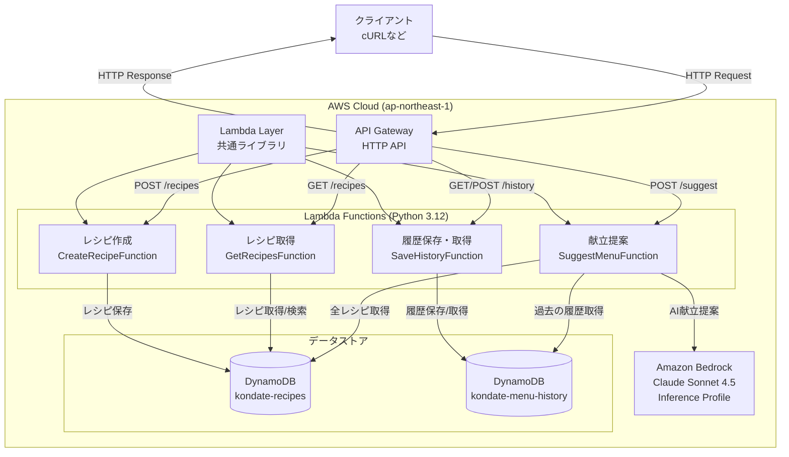
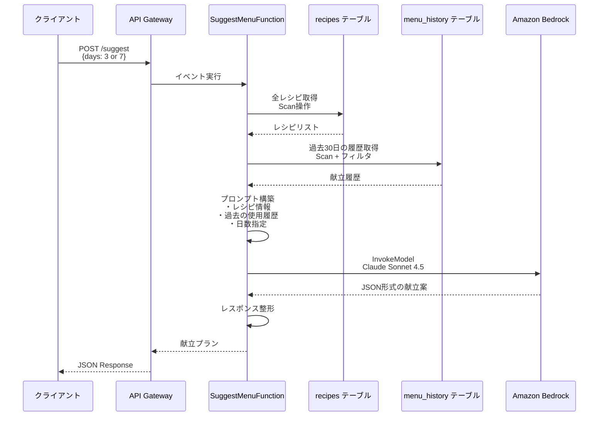
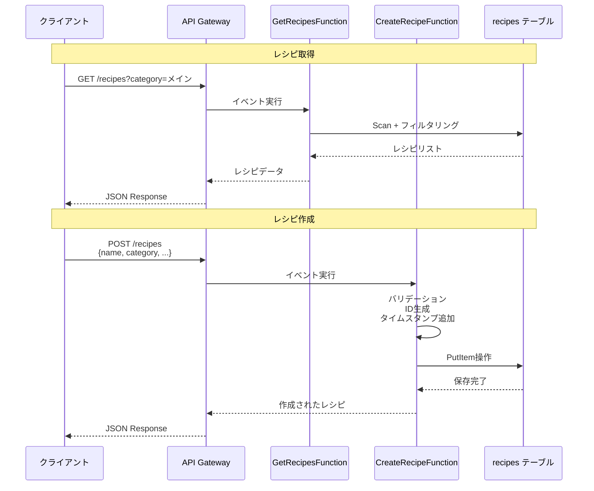
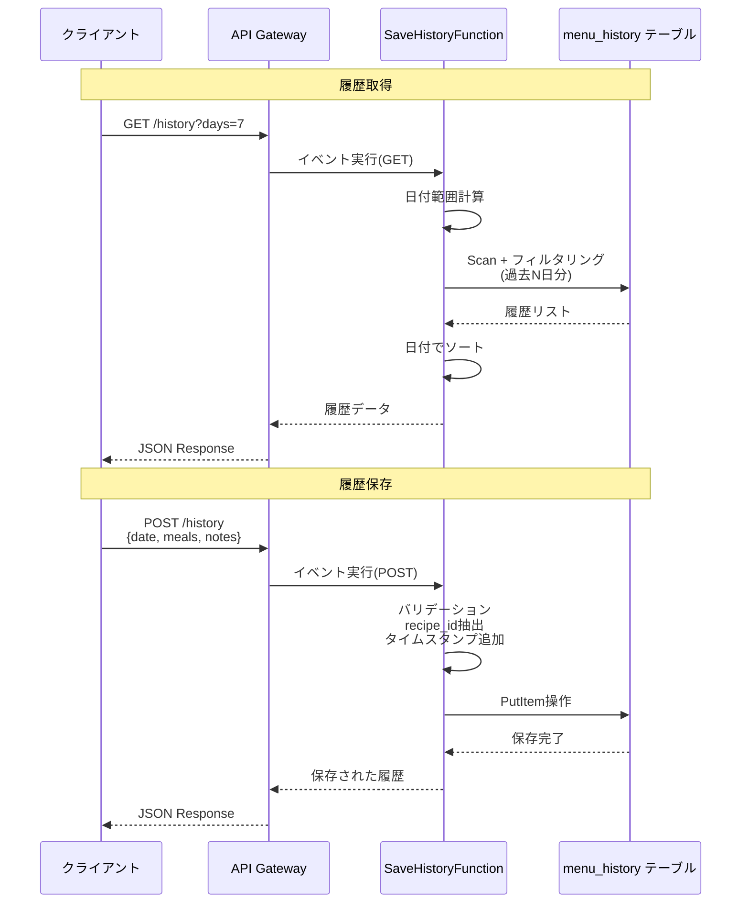
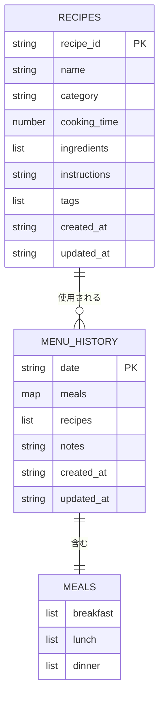

# 献立作成補助ツール

AWS SAMを使った個人利用の献立提案APIです。Amazon Bedrock (Claude Sonnet 4.5)を使って、レシピデータと献立履歴から最適な献立を提案します。

## 機能概要

- **献立提案**: AI（Claude）が3日分または7日分の献立を提案
- **レシピ管理**: レシピの作成・取得
- **献立履歴**: 過去の献立履歴を保存・取得

## システムアーキテクチャ

### 全体構成



### APIフロー

#### 献立提案フロー



#### レシピ管理フロー



#### 献立履歴フロー



### データモデル関係



### コンポーネント説明

| コンポーネント | 役割 | 主要機能 |
|---------------|------|---------|
| **API Gateway** | HTTPエンドポイント提供 | ルーティング、CORS設定 |
| **Lambda Layer** | 共通コードの提供 | レスポンス整形、AWSクライアント初期化など |
| **SuggestMenuFunction** | AI献立提案 | レシピ取得、履歴分析、Bedrock連携 |
| **GetRecipesFunction** | レシピ参照 | カテゴリフィルタ、一覧取得 |
| **CreateRecipeFunction** | レシピ登録 | バリデーション、ID生成 |
| **SaveHistoryFunction** | 履歴管理 | 保存・取得、日付フィルタリング |
| **DynamoDB (recipes)** | レシピ永続化 | NoSQLストレージ |
| **DynamoDB (menu_history)** | 履歴永続化 | 日付ベースの履歴管理 |
| **Amazon Bedrock** | AI推論 | Claude Sonnet 4.5による献立生成 |

## 技術スタック

- **Lambda**: Python 3.12
- **API Gateway**: HTTP API
- **DynamoDB**: 2テーブル（recipes, menu_history）
- **Amazon Bedrock**: Claude Sonnet 4.5
- **リージョン**: ap-northeast-1（東京）

## プロジェクト構成

```
kondate-planner/
├── template.yaml          # SAMテンプレート
├── samconfig.toml         # デプロイ設定
├── src/
│   ├── layers/            # 共通Lambda Layer
│   │   └── common/
│   │       └── python/
│   │           └── utils.py
│   ├── suggest_menu/      # 献立提案Lambda
│   │   ├── app.py
│   │   └── requirements.txt
│   ├── get_recipes/       # レシピ一覧取得Lambda
│   │   ├── app.py
│   │   └── requirements.txt
│   ├── create_recipe/     # レシピ作成Lambda
│   │   ├── app.py
│   │   └── requirements.txt
│   └── save_history/      # 献立履歴保存・取得Lambda
│       ├── app.py
│       └── requirements.txt
├── scripts/
│   └── seed_data.py       # データ投入スクリプト
└── README.md
```

## セットアップ

### 前提条件

- AWS CLI設定済み
- AWS SAM CLI インストール済み
- Python 3.12
- Amazon Bedrockのモデルアクセス許可（Claude Sonnet 4.5）

### 1. Bedrock モデルアクセスの有効化

AWSコンソールで以下を実行：
1. Amazon Bedrockコンソールを開く
2. 「Model access」に移動
3. 「Anthropic Claude Sonnet 4.5」のアクセスを有効化

### 2. ビルドとデプロイ

```bash
# ビルド
sam build

# デプロイ（初回）
sam deploy --guided

# 2回目以降
sam deploy
```

### 3. サンプルデータの投入

デプロイが完了したら、サンプルデータを投入します：

```bash
# boto3をインストール（未インストールの場合）
pip install boto3

# サンプルデータ投入（レシピ20件、履歴30日分）
python scripts/seed_data.py --recipes 20 --history 30
```

## API エンドポイント

デプロイ後、以下のエンドポイントが利用可能になります：

### 1. 献立提案

**POST** `/suggest`

```bash
curl -X POST https://YOUR_API_ENDPOINT/prod/suggest \
  -H "Content-Type: application/json" \
  -d '{"days": 3}'
```

リクエストボディ：
```json
{
  "days": 3  // 3 or 7
}
```

レスポンス例：
```json
{
  "menu_plan": [
    {
      "date": "2025-11-07",
      "meals": {
        "breakfast": [
          {"recipe_id": "recipe_011", "name": "トースト"},
          {"recipe_id": "recipe_010", "name": "卵焼き"}
        ],
        "lunch": [
          {"recipe_id": "recipe_015", "name": "チャーハン"}
        ],
        "dinner": [
          {"recipe_id": "recipe_001", "name": "カレーライス"},
          {"recipe_id": "recipe_009", "name": "味噌汁"},
          {"recipe_id": "recipe_013", "name": "サラダ"}
        ]
      },
      "notes": "バランスの良い献立"
    }
  ],
  "summary": "3日間の献立提案"
}
```

### 2. レシピ一覧取得

**GET** `/recipes`

```bash
curl https://YOUR_API_ENDPOINT/prod/recipes

# カテゴリでフィルタ
curl https://YOUR_API_ENDPOINT/prod/recipes?category=メイン
```

### 3. レシピ作成

**POST** `/recipes`

```bash
curl -X POST https://YOUR_API_ENDPOINT/prod/recipes \
  -H "Content-Type: application/json" \
  -d '{
    "name": "新しいレシピ",
    "category": "メイン",
    "cooking_time": 30,
    "ingredients": ["材料1", "材料2"],
    "instructions": "作り方",
    "tags": ["和食"]
  }'
```

### 4. 献立履歴保存

**POST** `/history`

```bash
curl -X POST https://YOUR_API_ENDPOINT/prod/history \
  -H "Content-Type: application/json" \
  -d '{
    "date": "2025-11-07",
    "meals": {
      "breakfast": [
        {"recipe_id": "recipe_011", "name": "トースト"},
        {"recipe_id": "recipe_010", "name": "卵焼き"}
      ],
      "lunch": [
        {"recipe_id": "recipe_015", "name": "チャーハン"}
      ],
      "dinner": [
        {"recipe_id": "recipe_001", "name": "カレーライス"},
        {"recipe_id": "recipe_009", "name": "味噌汁"}
      ]
    },
    "notes": "美味しかった"
  }'
```

### 5. 献立履歴取得

**GET** `/history`

```bash
curl https://YOUR_API_ENDPOINT/prod/history

# 過去7日分のみ取得
curl https://YOUR_API_ENDPOINT/prod/history?days=7
```

## ローカル開発

### ローカルでAPIを起動

```bash
sam local start-api
```

APIは `http://localhost:3000` で起動します。

### Lambda関数を個別にテスト

```bash
# 献立提案のテスト
echo '{"body": "{\"days\": 3}"}' | sam local invoke SuggestMenuFunction

# レシピ取得のテスト
sam local invoke GetRecipesFunction
```

### DynamoDBローカル（オプション）

ローカルでDynamoDBを使う場合：

```bash
# DynamoDB Localを起動
docker run -p 8000:8000 amazon/dynamodb-local

# テーブル作成
aws dynamodb create-table \
  --table-name kondate-recipes \
  --attribute-definitions AttributeName=recipe_id,AttributeType=S \
  --key-schema AttributeName=recipe_id,KeyType=HASH \
  --billing-mode PAY_PER_REQUEST \
  --endpoint-url http://localhost:8000

aws dynamodb create-table \
  --table-name kondate-menu-history \
  --attribute-definitions AttributeName=date,AttributeType=S \
  --key-schema AttributeName=date,KeyType=HASH \
  --billing-mode PAY_PER_REQUEST \
  --endpoint-url http://localhost:8000
```

## データベーススキーマ

### recipesテーブル

| フィールド | 型 | 説明 |
|-----------|-----|------|
| recipe_id | String (PK) | レシピID |
| name | String | レシピ名 |
| category | String | カテゴリ（メイン、副菜、朝食、汁物など） |
| cooking_time | Number | 調理時間（分） |
| ingredients | List | 材料リスト |
| instructions | String | 作り方 |
| tags | List | タグリスト |
| created_at | String | 作成日時 |
| updated_at | String | 更新日時 |

### menu_historyテーブル

| フィールド | 型 | 説明 |
|-----------|-----|------|
| date | String (PK) | 日付（YYYY-MM-DD） |
| meals | Map | 食事情報。各食事（breakfast/lunch/dinner）は配列形式で、複数のレシピオブジェクト（recipe_id, name）を含む |
| recipes | List | 使用したレシピIDのリスト（全食事の全レシピID） |
| notes | String | メモ |
| created_at | String | 作成日時 |
| updated_at | String | 更新日時 |

## トラブルシューティング

### Bedrock InvokeModel エラー

#### 1. モデルアクセスの確認

Bedrockのモデルアクセスが有効になっているか確認してください：

```bash
aws bedrock list-foundation-models --region ap-northeast-1 \
  --by-provider anthropic
```

#### 2. Inference Profile の使用（重要）

Claude Sonnet 4.5などの新しいモデルは、**Inference Profile経由でのみ呼び出し可能**です。

利用可能なInference Profileを確認：
```bash
aws bedrock list-inference-profiles --region ap-northeast-1
```

**正しいモデルID**: `jp.anthropic.claude-sonnet-4-5-20250929-v1:0` (Inference Profile)

❌ 間違い: `anthropic.claude-sonnet-4-5-v2:0` (存在しない)
❌ 間違い: `anthropic.claude-sonnet-4-5-20250929-v1:0` (直接モデルID - 使用不可)

#### 3. IAM権限の設定

Inference Profileは複数リージョンのモデルにルーティングするため、以下の**すべて**に対する権限が必要です：

```yaml
Resource:
  - 'arn:aws:bedrock:ap-northeast-1:${AccountId}:inference-profile/jp.anthropic.claude-sonnet-4-5-20250929-v1:0'
  - 'arn:aws:bedrock:ap-northeast-1::foundation-model/anthropic.claude-sonnet-4-5-20250929-v1:0'
  - 'arn:aws:bedrock:ap-northeast-3::foundation-model/anthropic.claude-sonnet-4-5-20250929-v1:0'
```

Inference Profileがap-northeast-1とap-northeast-3の両方にルーティングする場合、両リージョンのモデルへのアクセス権限が必要です。

#### 4. エラーメッセージの例と対処法

**エラー1**: "The provided model identifier is invalid"
- 原因: 間違ったモデルIDを使用
- 対処: Inference Profile IDを使用する

**エラー2**: "Invocation of model ID with on-demand throughput isn't supported"
- 原因: 直接モデルIDでの呼び出し
- 対処: Inference Profile IDを使用する

**エラー3**: "User is not authorized to perform: bedrock:InvokeModel on resource: arn:aws:bedrock:ap-northeast-3::foundation-model/..."
- 原因: ルーティング先リージョンのモデルへの権限不足
- 対処: 両リージョンのモデルARNを権限に追加する

### DynamoDB アクセスエラー

Lambda関数のIAMロールにDynamoDBアクセス権限があることを確認してください。SAMテンプレートに定義されています。

### デプロイエラー

S3バケットが必要な場合：

```bash
# 自動でS3バケットを作成してデプロイ
sam deploy --resolve-s3

# または手動でバケット作成
aws s3 mb s3://your-sam-deployment-bucket --region ap-northeast-1
sam deploy --s3-bucket your-sam-deployment-bucket
```

## クリーンアップ

リソースを削除する場合：

```bash
sam delete
```

## ライセンス

個人利用のプロジェクトです。

## 参考リンク

- [AWS SAM Documentation](https://docs.aws.amazon.com/serverless-application-model/)
- [Amazon Bedrock Documentation](https://docs.aws.amazon.com/bedrock/)
- [DynamoDB Documentation](https://docs.aws.amazon.com/dynamodb/)
