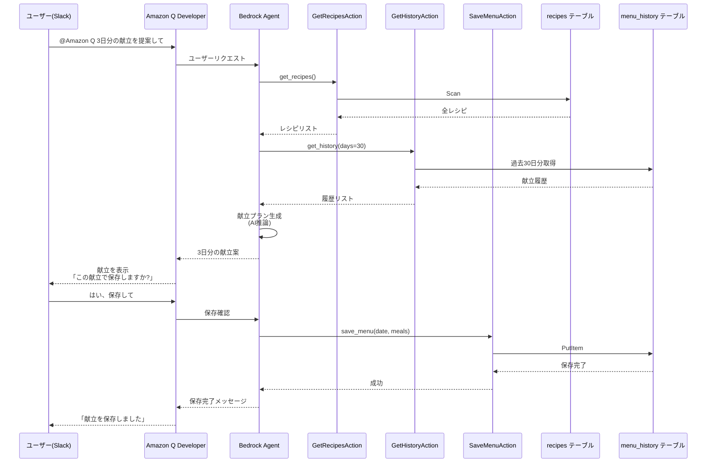

# 献立作成補助ツール

AWS SAMを使った個人利用の献立提案アプリケーションです。Amazon Bedrock Agentを使って、Slack経由で自然な会話形式で献立を提案します。

## 機能概要

- **Slack経由の対話型献立提案**: Amazon Q Developerを通じてSlackから自然言語で献立をリクエスト
- **AI献立生成**: Bedrock Agentが過去の履歴を考慮してバランスの良い献立を提案
- **履歴管理**: 過去の献立を参照し、同じレシピの繰り返しを避ける
- **明示的な保存確認**: ユーザーが承認した献立のみを保存

## システムアーキテクチャ

### 全体構成


Amazon Q DeveloperがSlack統合を担当し、Bedrock Agentが自然言語理解とLambdaアクションの実行を統括します。

### 対話フロー例



## 技術スタック

- **Lambda**: Python 3.12, ARM64
- **Bedrock Agent**: Foundation Model経由でAI推論（例: Claude Sonnet 4.5）
- **Amazon Q Developer**: Slack統合
- **DynamoDB**: 2テーブル（recipes, menu_history）
- **リージョン**: ap-northeast-1（東京）

## プロジェクト構成

```
kondate-planner/
├── template.yaml              # SAMテンプレート（OpenAPIスキーマ含む）
├── samconfig.toml             # デプロイ設定
├── AGENTS.md                  # アーキテクチャドキュメント（詳細）
├── CLAUDE.md -> AGENTS.md     # シンボリックリンク
├── src/
│   ├── agent_actions/         # Bedrock Agent用Lambda
│   │   ├── get_recipes/
│   │   │   ├── app.py
│   │   │   └── requirements.txt
│   │   ├── get_history/
│   │   │   ├── app.py
│   │   │   └── requirements.txt
│   │   └── save_menu/
│   │       ├── app.py
│   │       └── requirements.txt
│   ├── layers/                # 共通Lambda Layer
│   │   └── common/
│   │       └── utils.py
│   └── schemas/               # OpenAPIスキーマ（参照用のみ、実際はtemplate.yamlに埋め込み）
│       ├── get-recipes.yaml
│       ├── get-history.yaml
│       └── save-menu.yaml
├── scripts/
│   └── seed_data.py           # データ投入スクリプト
└── README.md
```

## セットアップ

### 前提条件

- AWS CLI設定済み
- AWS SAM CLI インストール済み
- Python 3.12
- Amazon Bedrockのモデルアクセス許可
- Slackワークスペース（Amazon Q Developer連携用）

### 1. Slackワークスペースの認証（初回のみ）

**重要**: デプロイ前に、Slackワークスペースを Amazon Q Developer に認証する必要があります：

1. **Amazon Q Developer Console** → **Configure new client**
2. **Slack** を選択
3. **Configure** をクリックしてSlackワークスペースを認証
4. 認証後、**Slack Workspace ID** をメモ（コンソールに表示されます）
5. **Slack Channel ID** を取得：
   - Slackでチャンネル名を右クリック
   - **Copy Link** を選択
   - URLの最後の部分がチャンネルID（例: `C12345ABCDE`）

### 2. ビルドとデプロイ

```bash
# ビルド
sam build

# デプロイ（Slack情報を含む）
sam deploy --parameter-overrides \
  SlackWorkspaceId=YOUR_WORKSPACE_ID \
  SlackChannelId=YOUR_CHANNEL_ID

# または、samconfig.toml に追加してから：
# parameter_overrides = "SlackWorkspaceId=XXX SlackChannelId=YYY"
sam deploy
```

**注意**: 公開リポジトリの場合、Slack IDを `samconfig.toml` にコミットしないでください。コマンドラインで指定するか、AWS Systems Manager Parameter Store を使用してください。

### 3. デプロイの確認

デプロイが完了すると、以下が自動的に作成されます：

- ✅ Bedrock Agent（`kondate-planner-agent`）
- ✅ Agent Alias（`production`）
- ✅ 3つのAction Lambda関数
- ✅ DynamoDBテーブル（recipes、menu-history）
- ✅ Developer Q Slack Channel設定
- ✅ IAMロールと権限

```bash
# デプロイ確認
aws cloudformation describe-stacks --stack-name kondate-planner \
  --query 'Stacks[0].Outputs[?OutputKey==`DeveloperQSlackChannelArn`].OutputValue' --output text
```

### 4. Bedrockエージェントの確認（オプション）

エージェントはCloudFormationで自動作成されますが、コンソールで確認できます：

1. **Amazon Bedrockコンソール** → **Agents**
2. `kondate-planner-agent` を選択
3. アクショングループが3つ設定されていることを確認
4. テストインターフェースで動作確認可能

**注意**: エージェント指示を変更する場合は `template.yaml` を編集し、再デプロイしてください。コンソールでの変更は次回デプロイ時に上書きされます。

### 5. サンプルデータの投入

```bash
# boto3をインストール（未インストールの場合）
pip install boto3

# サンプルデータ投入（レシピ20件、履歴30日分）
python scripts/seed_data.py --recipes 20 --history 30
```

### 6. SlackでBedrockコネクタを追加

デプロイ後、Slackチャンネルでエージェントに接続する必要があります：

```bash
# まず、Agent IDとAlias IDを取得
aws cloudformation describe-stacks --stack-name kondate-planner \
  --query 'Stacks[0].Outputs[?OutputKey==`BedrockAgentId` || OutputKey==`BedrockAgentAliasId`].[OutputKey,OutputValue]' \
  --output table
```

Slackチャンネルで以下のコマンドを実行：

```
@Amazon Q connector add kondate-planner arn:aws:bedrock:ap-northeast-1:YOUR_ACCOUNT_ID:agent/YOUR_AGENT_ID YOUR_ALIAS_ID
```

**例**:
```
@Amazon Q connector add kondate-planner arn:aws:bedrock:ap-northeast-1:123456789012:agent/ABCDEFGHIJ TESTALIASID
```

**注意**:
- `YOUR_ACCOUNT_ID`: AWSアカウントID
- `YOUR_AGENT_ID`: 上記コマンドで取得したAgent ID
- `YOUR_ALIAS_ID`: 上記コマンドで取得したAlias ID

### 7. Slackで動作確認

コネクタの追加が完了したら、設定したSlackチャンネルで:

```
@Amazon Q ask kondate-planner 3日分の献立を提案して
```

エージェントが以下を実行するはずです:
1. レシピを取得
2. 最近の履歴を取得
3. バランスの良い3日分の献立を生成
4. 保存前に確認を求める

## 使い方

### 献立の提案を受ける

```
@Amazon Q ask kondate-planner 7日分の献立を提案してください
```

### 最近の献立を確認

```
@Amazon Q ask kondate-planner最近の献立を見せて
```

### 特定カテゴリのレシピを見る

```
@Amazon Q ask kondate-planner 主菜のレシピを教えて
```

### 献立を保存

エージェントが献立を提案した後:

```
@Amazon Q 保存して
```

または

```
@Amazon Q いいえ、もっと魚料理を増やして
```

## データベーススキーマ

### recipesテーブル

| フィールド | 型 | 説明 |
|-----------|-----|------|
| recipe_id | String (PK) | レシピID |
| name | String | レシピ名 |
| category | String | カテゴリ（主菜、副菜、汁物、主食、デザート） |
| cooking_time | Number | 調理時間（分） |
| ingredients | List | 材料リスト |
| recipe_url | String | レシピのURL |
| tags | List | タグリスト |
| created_at | String | 作成日時 |
| updated_at | String | 更新日時 |

### menu_historyテーブル

| フィールド | 型 | 説明 |
|-----------|-----|------|
| date | String (PK) | 日付（YYYY-MM-DD） |
| meals | Map | 食事情報。breakfast/lunch/dinnerの各配列にレシピオブジェクト（recipe_id, name）を含む |
| recipes | List | 使用したレシピIDのフラットリスト（重複排除用） |
| notes | String | メモ（オプション） |
| created_at | String | 作成日時 |
| updated_at | String | 更新日時 |

## ローカル開発とテスト

### Lambda関数を個別にテスト

```bash
# レシピ取得のテスト
echo '{"category": "主菜"}' | sam local invoke GetRecipesActionFunction

# 履歴取得のテスト
echo '{"days": 7}' | sam local invoke GetHistoryActionFunction

# 献立保存のテスト
echo '{
  "date": "2025-11-09",
  "meals": {
    "breakfast": [{"recipe_id": "abc", "name": "味噌汁"}],
    "lunch": [{"recipe_id": "def", "name": "カレー"}],
    "dinner": [{"recipe_id": "ghi", "name": "焼き魚"}]
  }
}' | sam local invoke SaveMenuActionFunction
```

注: ローカルテストにはAWSのDynamoDBテーブルが必要です（DynamoDB Localは未対応）

## トラブルシューティング

### エージェントがアクションを見つけられない

1. `template.yaml` の `ApiSchema` にスキーマが正しく定義されているか確認
2. エージェントのアクショングループ設定が正しいか確認
3. Bedrockコンソールでエージェントを「Prepare」し直す

### Lambdaが呼び出されない

1. Lambda関数のリソースベースポリシーで `bedrock.amazonaws.com` からの呼び出しが許可されているか確認（SAMテンプレートで自動設定）
2. CloudWatch Logsでエラーを確認

### Bedrockモデルアクセスエラー

**エラー**: "The provided model identifier is invalid" や "Access denied"

**対処法**:
1. Amazon Bedrockコンソールで使用するモデルのアクセスが有効化されているか確認
2. エージェントのIAMロールに適切なBedrock権限があるか確認
3. Inference Profileを使用する場合、クロスリージョンのFoundation Modelへのアクセス権限も必要

**例: Claude Sonnet 4.5を使用する場合の権限**:
```yaml
Resource:
  - 'arn:aws:bedrock:ap-northeast-1:${AccountId}:inference-profile/jp.anthropic.claude-sonnet-4-5-20250929-v1:0'
  - 'arn:aws:bedrock:ap-northeast-1::foundation-model/anthropic.claude-sonnet-4-5-20250929-v1:0'
  - 'arn:aws:bedrock:ap-northeast-3::foundation-model/anthropic.claude-sonnet-4-5-20250929-v1:0'
```

### Amazon Q Developerが応答しない

1. Amazon Q Developer設定でBedrockエージェントが正しく選択されているか確認
2. Amazon Q DeveloperのIAMロールがエージェント呼び出し権限を持っているか確認
3. Slackチャンネルで `@Amazon Q` メンションをつけているか確認

## デプロイチェックリスト

新しい環境にデプロイする際（すべて自動化済み）:

### 初回セットアップ
- [ ] Amazon Bedrockで使用するFoundation Modelのアクセスを有効化
- [ ] Amazon Q Developer ConsoleでSlackワークスペースを認証
- [ ] Slack Workspace IDとChannel IDを取得

### デプロイ
- [ ] `sam build` を実行
- [ ] `sam deploy --parameter-overrides SlackWorkspaceId=XXX SlackChannelId=YYY` を実行
- [ ] デプロイ完了を確認（すべてのリソースが自動作成される）

### Bedrockコネクタの追加
- [ ] Agent IDとAlias IDを取得: `aws cloudformation describe-stacks --stack-name kondate-planner --query 'Stacks[0].Outputs[?OutputKey==\`BedrockAgentId\` || OutputKey==\`BedrockAgentAliasId\`].[OutputKey,OutputValue]' --output table`
- [ ] Slackで `@Amazon Q connector add kondate-planner arn:aws:bedrock:ap-northeast-1:YOUR_ACCOUNT_ID:agent/YOUR_AGENT_ID YOUR_ALIAS_ID` を実行

### 動作確認
- [ ] Slackでテスト: `@Amazon Q 3日分の献立を提案して`
- [ ] （オプション）Bedrockコンソールでエージェントを確認

### データ投入
- [ ] サンプルデータを投入: `python scripts/seed_data.py --recipes 20 --history 30`

**注意**: Bedrock Agent、アクショングループ、Slack設定はすべてCloudFormationで自動管理されます。手動設定は不要です。

## 今後の拡張予定

- レシピデータソースをDynamoDBからNotion APIに移行
- 大規模データセット向けのページネーション対応
- 複数週の献立計画サポート
- レシピ材料を使った栄養分析
- 食事制限や好みのサポート

## クリーンアップ

すべてのリソースを削除する場合:

```bash
# SAMスタックの削除
sam delete
```

## 参考リンク

- [AWS SAM Documentation](https://docs.aws.amazon.com/serverless-application-model/)
- [Amazon Bedrock Agents Documentation](https://docs.aws.amazon.com/bedrock/latest/userguide/agents.html)
- [Amazon Q Developer Documentation](https://docs.aws.amazon.com/amazonq/)
- [DynamoDB Documentation](https://docs.aws.amazon.com/dynamodb/)

## 詳細ドキュメント

アーキテクチャの詳細やLambda関数の実装詳細については、[AGENTS.md](./AGENTS.md) を参照してください。
