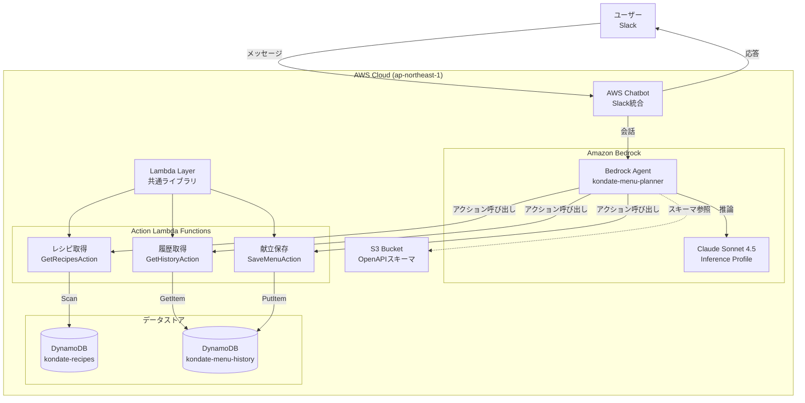
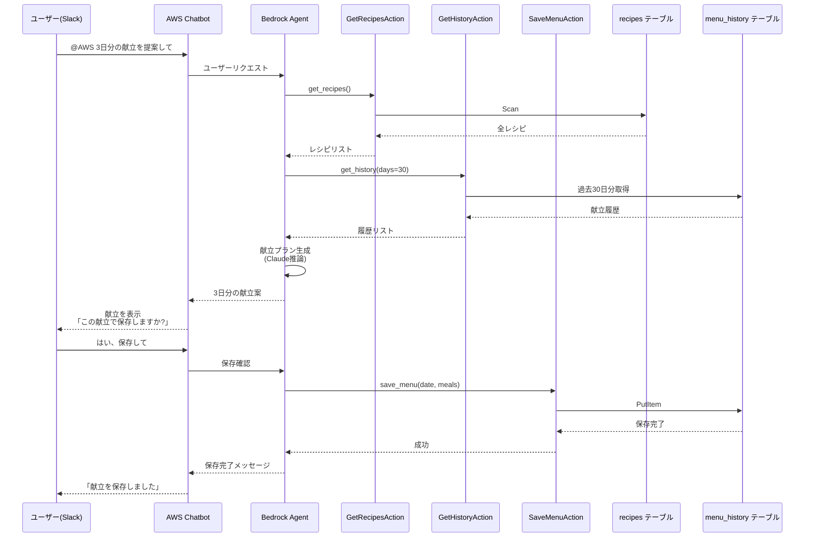

# 献立作成補助ツール

AWS SAMを使った個人利用の献立提案アプリケーションです。Amazon Bedrock AgentとClaude Sonnet 4.5を使って、Slack経由で自然な会話形式で献立を提案します。

## 機能概要

- **Slack経由の対話型献立提案**: AWS Chatbotを通じてSlackから自然言語で献立をリクエスト
- **AI献立生成**: Bedrock Agentが過去の履歴を考慮してバランスの良い献立を提案
- **履歴管理**: 過去の献立を参照し、同じレシピの繰り返しを避ける
- **明示的な保存確認**: ユーザーが承認した献立のみを保存

## システムアーキテクチャ

### 全体構成



**旧アーキテクチャとの違い**: REST APIやカスタムSlackハンドラーは不要。AWS ChatbotがSlack統合を担当し、Bedrock Agentが自然言語理解とLambdaアクションの実行を統括します。

### 対話フロー例



## 技術スタック

- **Lambda**: Python 3.12, ARM64
- **Bedrock Agent**: Claude Sonnet 4.5 (Inference Profile)
- **AWS Chatbot**: Slack統合
- **DynamoDB**: 2テーブル（recipes, menu_history）
- **S3**: OpenAPIスキーマ保存
- **リージョン**: ap-northeast-1（東京）

## プロジェクト構成

```
kondate-planner/
├── template.yaml              # SAMテンプレート
├── samconfig.toml             # デプロイ設定
├── AGENTS.md                  # アーキテクチャドキュメント（詳細）
├── CLAUDE.md -> AGENTS.md     # シンボリックリンク
├── src/
│   ├── agent_actions/         # Bedrock Agent用Lambda
│   │   ├── get_recipes/
│   │   │   ├── app.py
│   │   │   └── requirements.txt
│   │   ├── get_history/
│   │   │   ├── app.py
│   │   │   └── requirements.txt
│   │   └── save_menu/
│   │       ├── app.py
│   │       └── requirements.txt
│   ├── layers/                # 共通Lambda Layer
│   │   └── common/
│   │       └── utils.py
│   └── schemas/               # OpenAPIスキーマ
│       ├── recipe-management.yaml
│       └── history-management.yaml
├── scripts/
│   └── seed_data.py           # データ投入スクリプト
└── README.md
```

## セットアップ

### 前提条件

- AWS CLI設定済み
- AWS SAM CLI インストール済み
- Python 3.12
- Amazon Bedrockのモデルアクセス許可（Claude Sonnet 4.5）
- Slackワークスペース（AWS Chatbot連携用）

### 1. Bedrock モデルアクセスの有効化

AWSコンソールで以下を実行：
1. Amazon Bedrockコンソールを開く
2. 「Model access」に移動
3. 「Anthropic Claude Sonnet 4.5」のアクセスを有効化

### 2. ビルドとデプロイ

```bash
# ビルド
sam build

# デプロイ（初回）
sam deploy --guided

# 2回目以降
sam deploy
```

### 3. OpenAPIスキーマのアップロード

デプロイ後、スキーマファイルをS3にアップロードします：

```bash
# スタック出力からバケット名を取得
BUCKET_NAME=$(aws cloudformation describe-stacks \
  --stack-name kondate-planner \
  --query 'Stacks[0].Outputs[?OutputKey==`AgentSchemasBucketName`].OutputValue' \
  --output text)

# スキーマをアップロード
aws s3 cp src/schemas/recipe-management.yaml s3://${BUCKET_NAME}/recipe-management.yaml
aws s3 cp src/schemas/history-management.yaml s3://${BUCKET_NAME}/history-management.yaml
```

### 4. Bedrock Agentの作成

AWSコンソールでBedrockエージェントを作成します。

#### 4-1. エージェントの基本設定

1. Amazon Bedrockコンソール → Agents → Create agent
2. **エージェント名**: `kondate-menu-planner`
3. **説明**: `日本料理の献立計画アシスタント`
4. **モデル**: `Claude Sonnet 4.5`
5. **IAMロール**: デプロイ時の出力 `BedrockAgentRoleArn` を使用

#### 4-2. エージェント指示の設定

以下をエージェント指示欄に貼り付け：

```
あなたはバランスの取れた日本食の献立計画を支援する親切なアシスタントです。

利用可能なレシピと履歴:
- get_recipes() を呼び出して利用可能なレシピを確認できます。カテゴリでフィルタすることも可能です。
- get_history() を呼び出して最近の献立（デフォルト30日）を確認できます。レシピの重複を避けるために使用してください。

献立計画のルール:
献立を提案する際は以下を守ってください:
1. 朝食: 1-2品（例: ご飯+味噌汁、トースト+サラダ）
2. 昼食: 1-3品（バランス食またはお弁当スタイル）
3. 夕食: 2-3品（主菜+副菜+汁物が一般的）
4. バリエーション: 連続する日で同じ主要タンパク質を繰り返さない
5. バランス: 可能な限り毎食に野菜を含める
6. 調理時間: 短時間レシピ(<30分)と手の込んだレシピをミックス

ワークフロー:
1. ユーザーが献立提案を求めたら、レシピと最近の履歴を取得
2. 要求された日数（通常3日または7日）の献立プランを生成
3. レシピ名とカテゴリを含めて献立を明確に提示
4. 「この献立で保存しますか？」と尋ねる
5. ユーザーが明示的に確認した場合のみ save_menu() を呼び出す（はい/保存して/良さそう等）
6. ユーザーが拒否または変更を求めた場合は、フィードバックに基づいて再生成

トーン:
- フレンドリーで会話的に
- ユーザーの言語（日本語または英語）で応答
- 関連する場合は簡単な調理のヒントや栄養情報を提供
```

#### 4-3. アクショングループの追加

**アクショングループ1: RecipeManagement**
- 名前: `RecipeManagement`
- 説明: `レシピデータベースへのアクセス`
- Lambda: `GetRecipesActionFunction` を選択
- OpenAPIスキーマ: S3から選択
  - バケット: `kondate-agent-schemas-{YOUR-ACCOUNT-ID}`
  - オブジェクトキー: `recipe-management.yaml`

**アクショングループ2: HistoryManagement**
- 名前: `HistoryManagement`
- 説明: `献立履歴の管理`
- Lambda: `GetHistoryActionFunction` を選択
- OpenAPIスキーマ: S3から選択
  - バケット: `kondate-agent-schemas-{YOUR-ACCOUNT-ID}`
  - オブジェクトキー: `history-management.yaml`

**アクショングループ3: SaveHistory**
- 名前: `SaveHistory`
- 説明: `承認された献立の保存`
- Lambda: `SaveMenuActionFunction` を選択
- OpenAPIスキーマ: 同じ `history-management.yaml`

#### 4-4. エージェントの準備

1. 「Prepare」ボタンをクリック（約2分）
2. テストコンソールで動作確認:
   - 「3日分の献立を提案して」
   - 「最近の献立を見せて」
3. **Alias**を作成（例: `production`）

### 5. AWS Chatbotの設定

#### 5-1. Slackワークスペースの接続

1. AWS Chatbotコンソールを開く
2. 「Configure new client」→ **Slack** を選択
3. Slackワークスペースを認証
4. チャンネルを選択（例: `#kondate-planner`）

#### 5-2. Bedrock Agent統合

1. チャンネル設定で:
   - 「Amazon Bedrock Agent」を有効化
   - エージェント: `kondate-menu-planner` を選択
   - エイリアス: `production`（または `DRAFT`）を選択
2. IAMロール権限:
   - `AmazonBedrockFullAccess` を付与（またはエージェント専用のスコープポリシー）

### 6. サンプルデータの投入

```bash
# boto3をインストール（未インストールの場合）
pip install boto3

# サンプルデータ投入（レシピ20件、履歴30日分）
python scripts/seed_data.py --recipes 20 --history 30
```

### 7. Slackでテスト

設定したSlackチャンネルで:

```
@AWS 3日分の献立を提案して
```

エージェントが以下を実行するはずです:
1. レシピを取得
2. 最近の履歴を取得
3. バランスの良い3日分の献立を生成
4. 保存前に確認を求める

## 使い方

### 献立の提案を受ける

```
@AWS 7日分の献立を提案してください
```

### 最近の献立を確認

```
@AWS 最近の献立を見せて
```

### 特定カテゴリのレシピを見る

```
@AWS 主菜のレシピを教えて
```

### 献立を保存

エージェントが献立を提案した後:

```
保存して
```

または

```
いいえ、もっと魚料理を増やして
```

## データベーススキーマ

### recipesテーブル

| フィールド | 型 | 説明 |
|-----------|-----|------|
| recipe_id | String (PK) | レシピID |
| name | String | レシピ名 |
| category | String | カテゴリ（主菜、副菜、汁物、主食、デザート） |
| cooking_time | Number | 調理時間（分） |
| ingredients | List | 材料リスト |
| recipe_url | String | レシピのURL |
| tags | List | タグリスト |
| created_at | String | 作成日時 |
| updated_at | String | 更新日時 |

### menu_historyテーブル

| フィールド | 型 | 説明 |
|-----------|-----|------|
| date | String (PK) | 日付（YYYY-MM-DD） |
| meals | Map | 食事情報。breakfast/lunch/dinnerの各配列にレシピオブジェクト（recipe_id, name）を含む |
| recipes | List | 使用したレシピIDのフラットリスト（重複排除用） |
| notes | String | メモ（オプション） |
| created_at | String | 作成日時 |
| updated_at | String | 更新日時 |

## ローカル開発とテスト

### Lambda関数を個別にテスト

```bash
# レシピ取得のテスト
echo '{"category": "主菜"}' | sam local invoke GetRecipesActionFunction

# 履歴取得のテスト
echo '{"days": 7}' | sam local invoke GetHistoryActionFunction

# 献立保存のテスト
echo '{
  "date": "2025-11-09",
  "meals": {
    "breakfast": [{"recipe_id": "abc", "name": "味噌汁"}],
    "lunch": [{"recipe_id": "def", "name": "カレー"}],
    "dinner": [{"recipe_id": "ghi", "name": "焼き魚"}]
  }
}' | sam local invoke SaveMenuActionFunction
```

注: ローカルテストにはAWSのDynamoDBテーブルが必要です（DynamoDB Localは未対応）

## トラブルシューティング

### エージェントがアクションを見つけられない

1. OpenAPIスキーマがS3に正しくアップロードされているか確認
2. エージェントのアクショングループ設定でスキーマパスが正しいか確認
3. エージェントを「Prepare」し直す

### Lambdaが呼び出されない

1. Lambda関数のリソースベースポリシーで `bedrock.amazonaws.com` からの呼び出しが許可されているか確認（SAMテンプレートで自動設定）
2. CloudWatch Logsでエラーを確認

### Bedrockモデルアクセスエラー

**エラー**: "The provided model identifier is invalid"

**対処法**:
- Claude Sonnet 4.5は **Inference Profile経由でのみ** 呼び出し可能
- 正しいモデルID: `jp.anthropic.claude-sonnet-4-5-20250929-v1:0`

**IAM権限**: 以下のすべてに対する権限が必要:
```yaml
Resource:
  - 'arn:aws:bedrock:ap-northeast-1:${AccountId}:inference-profile/jp.anthropic.claude-sonnet-4-5-20250929-v1:0'
  - 'arn:aws:bedrock:ap-northeast-1::foundation-model/anthropic.claude-sonnet-4-5-20250929-v1:0'
  - 'arn:aws:bedrock:ap-northeast-3::foundation-model/anthropic.claude-sonnet-4-5-20250929-v1:0'
```

### AWS Chatbotが応答しない

1. Chatbot設定でBedrockエージェントが正しく選択されているか確認
2. ChatbotのIAMロールがエージェント呼び出し権限を持っているか確認
3. Slackチャンネルで `@AWS` メンションをつけているか確認

## デプロイチェックリスト

新しい環境にデプロイする際:

- [ ] `sam build && sam deploy --guided` を実行
- [ ] スタック出力からS3バケット名を確認
- [ ] OpenAPIスキーマをS3にアップロード
- [ ] Bedrockコンソールでエージェントを作成（スタック出力のARNを使用）
- [ ] アクショングループを正しいLambda ARNで追加
- [ ] エージェントを「Prepare」
- [ ] Bedrockコンソールでエージェントをテスト
- [ ] エージェントエイリアス（`production`）を作成
- [ ] AWS ChatbotでSlackワークスペースを設定
- [ ] Chatbotをエージェントエイリアスに接続
- [ ] Slackチャンネルでエンドツーエンドテスト
- [ ] サンプルデータを投入: `python scripts/seed_data.py --recipes 20 --history 30`

## 今後の拡張予定

- レシピデータソースをDynamoDBからNotion APIに移行
- 大規模データセット向けのページネーション対応
- 複数週の献立計画サポート
- レシピ材料を使った栄養分析
- 食事制限や好みのサポート

## クリーンアップ

すべてのリソースを削除する場合:

```bash
# SAMスタックの削除
sam delete

# 手動作成したリソースも削除
# - Bedrock Agent（コンソールから）
# - AWS Chatbot設定（コンソールから）
```

## 参考リンク

- [AWS SAM Documentation](https://docs.aws.amazon.com/serverless-application-model/)
- [Amazon Bedrock Agents Documentation](https://docs.aws.amazon.com/bedrock/latest/userguide/agents.html)
- [AWS Chatbot Documentation](https://docs.aws.amazon.com/chatbot/)
- [DynamoDB Documentation](https://docs.aws.amazon.com/dynamodb/)

## 詳細ドキュメント

アーキテクチャの詳細やLambda関数の実装詳細については、[AGENTS.md](./AGENTS.md) を参照してください。
